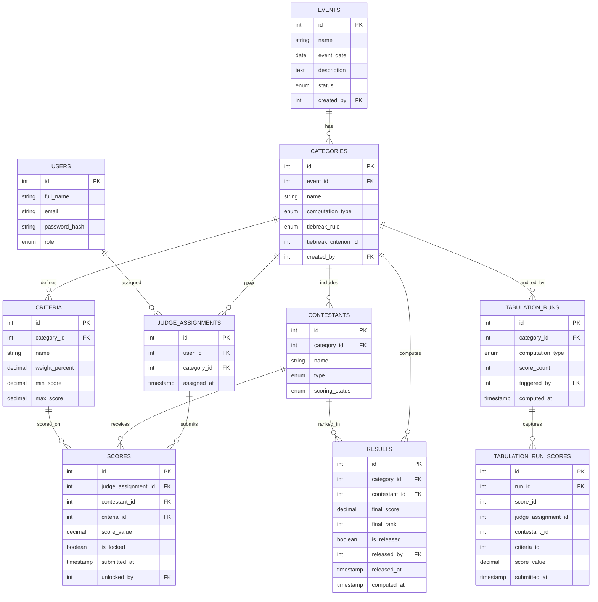

# Tabulation System for School Events — Project Documentation

**Institution:** USTP Jasaan
**Subject:** Software Engineering
**Status:** Sprint 6+ (Live — Reporting & Results complete)
**Last updated:** 2026-09-11

> This is a living document. Add revision notes at the bottom of each section as things change. Don't delete old content when revising — strike it through or move it to the Revision Log so the history is preserved for documentation purposes.

---

## 1. Project Overview

A web-based tabulation and scoring management system for USTP Jasaan school events. Replaces manual/Excel-based tabulation across mixed event types (pageants, academic contests, sportsfest/Paugnat Days) with a single configurable system.

**Core principle:** the scoring engine is *configurable*, not hardcoded — admins define criteria, weights, and computation method per event category, and the tabulation engine executes whatever rule is defined. This lets one system handle a quiz bee (raw points) and a pageant (weighted, rank-normalized) without separate codebases.

**Development methodology:** Agile/Incremental.

---

## 2. Actors

| Actor | Role |
|---|---|
| Admin | Sets up events, categories, criteria, weights, computation method; manages users; unlocks scores |
| Tabulator | Oversees live event, monitors scoring progress, recomputes, releases/holds results, unlocks scores |
| Judge | Submits scores for contestants/teams in their assigned category only |
| Viewer / Audience | Read-only access to live or released results (public; no login required) |

*Note: Admin and Tabulator can be the same person in smaller deployments, but are separated in the design for proper role-based access control. The `viewer` role also exists as an authenticated read-only account (migration 002).*

---

## 3. Functional Requirements

### Event & Criteria Management
- FR1: Admin shall be able to create an event with a name, date, description, and status (`draft` / `live` / `archived`)
- FR2: Admin shall be able to add one or more categories under an event
- FR3: Admin shall be able to define scoring criteria (name, weight %, min score, max score) per category
- FR4: Admin shall be able to select a computation method per category (raw average, rank-based, weighted criteria)
- FR4b: Admin shall be able to configure a tie-break rule per category (`highest_criterion`, `sum_criteria`, `more_top_ranks`, `lowest_variance`, `manual`)

### Contestant/Team Management
- FR5: Admin shall be able to register contestants or teams (`solo` / `team`) under a category with a scoring status (`not_started`, `in_progress`, `complete`, `locked`)

### Judge & Scoring
- FR6: Admin shall be able to assign judges to specific categories (unique per judge-category pair)
- FR7: Judge shall be able to log in and view only their assigned category's scoring form
- FR8: Judge shall be able to submit scores per contestant per criterion; scores start as a draft and are locked on final submission
- FR9: System shall lock a judge's submitted score from further editing unless reopened by Admin or Tabulator — unlock records who performed it and automatically un-releases any result that was previously released
- FR10: Judge shall not be able to view other judges' submitted scores

### Tabulation & Results
- FR11: System shall automatically compute final scores based on the category's defined computation method
- FR12: System shall handle tie-breaking based on the configured rule (automatic for non-manual rules; flagged for manual resolution when unresolved ties are detected)
- FR13: Tabulator shall be able to release or hold final results from public view
- FR14: System shall display a live leaderboard (viewer-facing) that shows provisional results immediately and clearly labels them as unreleased until Tabulator releases
- FR14b: Tabulator shall be able to manually trigger recomputation on demand

### Reports (FR15 — Implemented)
- FR15a: System shall generate a printable/exportable official results sheet (HTML printable view, no sidebar)
- FR15b: System shall export results as CSV (Rank, Contestant, Type, Final Score, Judge Scores, Released By, Released At)
- FR15c: System shall export results as a server-rendered PDF (no third-party library required)
- FR15d: System shall export a detailed per-criterion score breakdown as a PDF

### Security
- FR16: All state-mutating requests (POST) are protected by CSRF token verification
- FR17: All role-sensitive endpoints enforce role-based access control before any logic runs

*(Non-functional requirements — performance, usability — to be added.)*

---

## 4. Scope & Limitations (v1 — confirmed)

**In scope:**
- Mixed event types via configurable criteria/weights
- Web-based, mobile-responsive judge scoring (own device)
- 3 computation methods: raw average, rank-based, weighted criteria
- 5 tie-break rules: `highest_criterion`, `sum_criteria`, `more_top_ranks`, `lowest_variance`, `manual`
- Real-time update method: polling (PHP simplicity; decided against WebSockets)
- Score unlock with audit trail (who unlocked, automatic recompute + unrelease)
- Tabulation audit log (each recompute run records which scores were used)
- CSV and PDF export (server-rendered, no third-party PDF library)

**Out of scope / not yet implemented:**
- Offline scoring support (PWA/sync)
- Email notifications

---

## 5. Use Case Diagram


- **Admin** → Manage events/criteria, Register contestants, Assign judges, Manage users, Unlock scores
- **Tabulator** → Review results, Recompute tabulation, Release/hold final results, Unlock scores, Export reports
- **Judge** → View assigned scoring form, Submit scores per criterion
- **Viewer** → View live/released results (public leaderboard)

---

## 5.1 Detailed Use Case Descriptions

### UC-01: Submit Score

| Field | Description |
|---|---|
| **Actor** | Judge |
| **Precondition** | Judge is logged in and assigned to a category; category has active contestants and defined criteria |
| **Trigger** | Judge opens the scoring form for a contestant |

**Main flow:**
1. Judge logs in and is routed to their assigned category's scoring dashboard
2. System displays list of contestants/teams for that category, with per-contestant status (`empty`, `draft`, `submitted`)
3. Judge selects a contestant to score
4. System displays scoring form with all criteria for that category (name, weight %, min/max score)
5. Judge enters a score per criterion
6. Judge submits the form
7. System validates: all criteria filled, scores within min/max range, cross-category integrity check (assignment, contestant, and criterion must all belong to the same category)
8. System saves the score, marks it as locked, and timestamps the submission
9. System triggers automatic recomputation for the category via `CategoryResults::recompute()`
10. System returns judge to contestant list, marking that contestant as "submitted"

**Alternate flows:**
- 7a. Validation fails (missing field, out-of-range score) → system displays inline error, does not save, judge corrects and resubmits
- 8a. Judge needs to correct an already-submitted score → judge requests unlock from Admin/Tabulator (FR9); score remains locked until explicitly reopened; previously released results are automatically un-released and recomputed

**Postcondition:** Score is saved and locked; not visible to other judges; included in next tabulation computation

---

### UC-02: Compute Tabulation

| Field | Description |
|---|---|
| **Actor** | System (triggered automatically on score submit, or by Tabulator manually) |
| **Precondition** | At least one locked judge score exists for the category |
| **Trigger** | Score submitted (`ScoreController::submit`) or Tabulator clicks "Recompute" (`TabulatorController::recompute`) |

**Main flow:**
1. `CategoryResults::recompute()` fetches all locked scores for the category
2. Scores are structured as `[judgeId][contestantId][criteriaId] => score_value`
3. `TabulationEngine::compute()` selects the branch based on `computation_type`:
   - **`raw_average`:** sum each judge's criteria scores per contestant (unweighted), average across judges
   - **`rank_based`:** each judge's scores converted to a rank per contestant, average ranks across judges; lowest average rank wins
   - **`weighted_criteria`:** each criterion score x (weight% / 100) per judge, summed per judge, then averaged across judges
4. `rankWithTiebreak()` assigns final ranks, resolving ties using the configured `tiebreak_rule` automatically where possible
5. System writes a `tabulation_runs` audit record (who triggered, when, how many scores, computation type)
6. System writes a `tabulation_run_scores` snapshot of every score used in this run
7. `ResultModel::saveResult()` upserts each contestant's `final_score` and `final_rank` in the `results` table

**Alternate flows:**
- 4a. Tie detected and `tiebreak_rule = 'manual'` → tied contestants share the same rank; Tabulator is warned in the review screen
- 1a. No locked scores exist → function returns early without writing any results

**Postcondition:** Computed results stored; audit trail preserved; not yet publicly visible unless Tabulator releases

---

### UC-03: Release Final Results

| Field | Description |
|---|---|
| **Actor** | Tabulator |
| **Precondition** | Tabulation has been computed; Tabulator is logged in |
| **Trigger** | Tabulator clicks "Release Results" on the review screen |

**Main flow:**
1. Tabulator opens the review screen (`/tabulator/review/{categoryId}`)
2. System displays computed rankings and runs pre-release blocker checks:
   - All assigned judges have completed scoring (progress = 100%)
   - Criteria and contestants exist
   - For `weighted_criteria`: weights total exactly 100%
   - Computed results exist
   - No unresolved tied ranks
3. If no blockers: Tabulator clicks "Release Results"
4. System recomputes one final time, then marks all results for the category as `is_released = TRUE`, records `released_by` and `released_at`
5. Public leaderboard immediately reflects released results (label changes from "Provisional" to "Official")
6. System logs release (who, when) — retrievable via Reports

**Alternate flows:**
- 2a. Blockers present → "Release Results" button is disabled; warnings are shown inline; Tabulator must resolve each blocker first
- Hold: Tabulator can click "Hold Results" at any time to revert to `is_released = FALSE` for any category

**Postcondition:** Results publicly visible; release logged; results exportable via Reports

---

## 5.2 Database Schema (ERD)

**Tables (10 total — 8 core + 2 audit):**

| Table | Purpose |
|---|---|
| `users` | System users; `role` ENUM: `admin`, `tabulator`, `judge`, `viewer` |
| `events` | Top-level event (name, date, description, `status`: `draft`/`live`/`archived`, created_by) |
| `categories` | Sub-event under an event; holds `computation_type`, `tiebreak_rule`, `tiebreak_criterion_id` |
| `criteria` | Scoring criteria per category (name, weight %, `min_score`, `max_score`) |
| `contestants` | Individuals or teams; `type`: `solo`/`team`; `scoring_status`: `not_started`/`in_progress`/`complete`/`locked` |
| `judge_assignments` | Links a user (judge) to a category; `UNIQUE(user_id, category_id)` |
| `scores` | Raw judge input per contestant per criterion; `is_locked`, `submitted_at`, `unlocked_by` |
| `results` | Computed output only (`final_score`, `final_rank`, `is_released`, `released_by`, `released_at`, `computed_at`) |
| `tabulation_runs` | Audit log of each recompute: who triggered, when, computation type, score count |
| `tabulation_run_scores` | Snapshot of every score value included in a specific `tabulation_runs` record |

**Key relationships:**
- `events` 1->many `categories`
- `categories` 1->many `criteria`, `contestants`, `judge_assignments`, `results`, `tabulation_runs`
- `users` 1->many `judge_assignments`
- `judge_assignments` 1->many `scores`
- `contestants` and `criteria` 1->many `scores`
- `contestants` 1->many `results`
- `tabulation_runs` 1->many `tabulation_run_scores`



*Note: this Mermaid block renders automatically in GitHub, VS Code (with Markdown Preview Mermaid extension), Notion, and most modern Markdown viewers. If your submission tool does not support Mermaid, paste the code block into https://mermaid.live to export as PNG/SVG.*

---

## 5.3 System Architecture (3-Tier MVC)


Same pattern as the Teacher Evaluation system (3-tier MVC), with one key addition: the **Tabulation Engine** is kept as its own module inside the business logic layer, separate from the generic MVC controllers. It reads a category's `computation_type` and branches into the correct scoring logic (raw average / rank-based / weighted criteria).

A second orchestrator, **`CategoryResults`**, bridges the controllers and the engine: it fetches raw scores, formats them, calls the engine, persists results, and writes the audit trail. Controllers stay thin — they just call `CategoryResults::recompute()`.

**Why keep computation separate from controllers:**
- Easier to unit test in isolation — feed it sample scores, assert the computed output, no HTTP/session dependencies involved
- Controllers stay thin — they just orchestrate (fetch scores, call the engine, save results), the engine holds all computation logic
- If a computation bug is found, the fix is isolated to one module instead of scattered across multiple controller methods

| Layer | Components |
|---|---|
| Presentation | Judge scoring view, Admin dashboard, Tabulator review, Live leaderboard — all mobile-responsive |
| Business logic | MVC controllers, `TabulationEngine`, `CategoryResults` orchestrator, `Auth` / roles module |
| Data | MySQL database (`ustp_tabulation`) |

---

## 5.4 Low-Fidelity Wireframes

Open `diagrams/wireframes.html` in a browser to view all three screens side by side.

**1. Admin dashboard** — overview of categories under an event, with live scoring progress per category (e.g. "3/4 scored") so Admin can spot an incomplete category before Tabulator attempts release.

**2. Judge scoring screen** — one contestant per screen, one criterion per slider, weight % shown next to each criterion so the judge knows what matters most. Clear "locked once submitted" notice tied to FR9.

**3. Live leaderboard** — public-facing ranking view, clearly labeled "Live" / "Provisional" or "Official", with event/category selector. Shows computed results immediately; unreleased results carry a "Provisional" banner.

*Sprint 1 (System Design) complete — ERD, architecture diagram, and wireframes all documented above.*

---

## 5.5 Sprint 2 — Core Backend, Auth, and Tabulation Engine

Project structure (actual current state):

```
tabulation_system/
|-- .env / .env.example         -- environment config (DB_HOST, DB_DATABASE, DB_USERNAME, DB_PASSWORD)
|-- .htaccess                   -- redirect all requests to public/
|-- database/
|   |-- schema.sql              -- full MySQL schema (10 tables)
|   `-- migrations/
|       |-- 001_add_tabulation_audit.sql
|       `-- 002_add_viewer_role.sql
|-- config/
|   `-- database.php            -- PDO connection config (reads .env)
|-- app/
|   |-- core/
|   |   |-- Auth.php            -- login, session, role-based access control
|   |   |-- CategoryResults.php -- orchestrates engine + audit + result persistence
|   |   |-- Controller.php      -- base controller (view/json/redirect helpers)
|   |   |-- Model.php           -- base model (shared PDO instance)
|   |   `-- TabulationEngine.php -- pure computation logic (no DB/session dependency)
|   |-- controllers/
|   |   |-- AdminController.php
|   |   |-- AuthController.php
|   |   |-- JudgeController.php
|   |   |-- ReportController.php
|   |   |-- ScoreController.php
|   |   |-- TabulatorController.php
|   |   `-- ViewerController.php
|   |-- models/
|   |   |-- CategoryModel.php
|   |   |-- ContestantModel.php
|   |   |-- CriteriaModel.php
|   |   |-- EventModel.php
|   |   |-- JudgeAssignmentModel.php
|   |   |-- ReportModel.php
|   |   |-- ResultModel.php
|   |   |-- ScoreModel.php
|   |   |-- TabulationAuditModel.php
|   |   `-- UserModel.php
|   `-- views/
|       |-- admin/              -- 21 view files (dashboard, CRUD forms, layout)
|       |-- auth/
|       |-- judge/              -- dashboard, scoring, layout
|       |-- reports/            -- index, category, event, printable, score_sheets
|       |-- shared/             -- locked_scores.php
|       |-- tabulator/          -- dashboard, review, scores, layout
|       `-- viewer/             -- leaderboard, layout
`-- public/
    |-- .htaccess               -- remove index.php from URLs
    `-- index.php               -- front controller / router (40+ routes)
```

**What's implemented:**

- **`database/schema.sql`** — 10 tables (8 core + 2 audit), with foreign keys, ENUM columns, audit columns (`is_locked`, `unlocked_by`, `released_by`, `released_at`). Includes a seed Admin account.
- **`Auth.php`** — session-based login with `requireRole()`, `requireAnyRole()`, and `judgeOwnsCategoryAssignment()` — the enforcement mechanism for FR7/FR10.
- **`TabulationEngine.php`** — implements all three computation types plus all five tie-break rules as pure static functions. No database or session dependency.
- **`CategoryResults.php`** — thin orchestrator: fetches locked scores, formats them, calls the engine, writes audit run + snapshot, upserts results.
- **All 7 controllers** — fully implemented (see Section 5.6 for routes).
- **All 10 models** — fully implemented.
- **CSRF protection** — `csrf_token()` generated per session; `verify_csrf_token()` called on every POST. Header `X-CSRF-TOKEN` also accepted for AJAX calls.
- **Environment config** — `.env` file with DB credentials; `.env.example` committed to version control.

---

## 5.6 Sprint 3-6 — All Modules Implemented

### Routing Table (`public/index.php`)

| Method | URL Pattern | Controller | Action |
|---|---|---|---|
| GET/POST | `login` | AuthController | login |
| GET/POST | `logout` | AuthController | logout |
| GET | `admin` | AdminController | index (dashboard) |
| GET | `admin/events` | AdminController | events |
| GET/POST | `admin/events/create` | AdminController | createEvent |
| GET/POST | `admin/events/edit/{id}` | AdminController | editEvent |
| POST | `admin/events/delete/{id}` | AdminController | deleteEvent |
| GET | `admin/categories` | AdminController | categories |
| GET/POST | `admin/categories/create` | AdminController | createCategory |
| GET/POST | `admin/categories/edit/{id}` | AdminController | editCategory |
| POST | `admin/categories/delete/{id}` | AdminController | deleteCategory |
| GET | `admin/criteria` | AdminController | criteria |
| GET/POST | `admin/criteria/create` | AdminController | createCriterion |
| GET/POST | `admin/criteria/edit/{id}` | AdminController | editCriterion |
| POST | `admin/criteria/delete/{id}` | AdminController | deleteCriterion |
| GET | `admin/contestants` | AdminController | contestants |
| GET/POST | `admin/contestants/create` | AdminController | createContestant |
| GET/POST | `admin/contestants/edit/{id}` | AdminController | editContestant |
| POST | `admin/contestants/delete/{id}` | AdminController | deleteContestant |
| GET | `admin/judges` | AdminController | judges |
| GET/POST | `admin/judges/assign` | AdminController | assignJudge |
| POST | `admin/judges/remove/{id}` | AdminController | removeJudge |
| GET | `admin/users` | AdminController | users |
| GET/POST | `admin/users/create` | AdminController | createUser |
| GET/POST | `admin/users/edit/{id}` | AdminController | editUser |
| POST | `admin/users/delete/{id}` | AdminController | deleteUser |
| GET | `admin/scores` | AdminController | scores |
| POST | `admin/scores/unlock/{assignmentId}/{contestantId}` | AdminController | unlockScore |
| GET | `judge` | JudgeController | dashboard |
| GET | `judge/score/{categoryId}` | JudgeController | score |
| GET | `tabulator` | TabulatorController | index |
| GET | `tabulator/review/{categoryId}` | TabulatorController | review |
| POST | `tabulator/recompute/{categoryId}` | TabulatorController | recompute |
| GET | `tabulator/scores` | TabulatorController | scores |
| POST | `tabulator/release/{categoryId}` | TabulatorController | release |
| POST | `tabulator/hold/{categoryId}` | TabulatorController | hold |
| GET | `viewer` | ViewerController | index |
| GET | `score/form` | ScoreController | form |
| POST | `score/submit` | ScoreController | submit |
| GET | `reports` | ReportController | index |
| GET | `reports/category/{id}` | ReportController | category |
| GET | `reports/event/{id}` | ReportController | event |
| GET | `reports/scoresheet/{contestantId}/{categoryId}` | ReportController | scoreSheet |
| GET | `reports/printable/{id}` | ReportController | printable |
| GET | `reports/export-csv/{id}` | ReportController | exportCsv |
| GET | `reports/export-pdf/{id}` | ReportController | exportPdf |
| GET | `reports/export-breakdown-pdf/{id}` | ReportController | exportBreakdownPdf |

### Admin Module (Sprint 3 + 4)

Full CRUD for: Events, Categories, Criteria, Contestants, Users, Judge Assignments.

**Admin Dashboard stats:**
- Total events, live events
- Total categories, criteria, contestants, judges
- Released categories count
- Pending (incomplete) categories count

**Admin score management (FR9):**
- `/admin/scores` — view all locked judge submissions, filterable by category
- `/admin/scores/unlock/{assignmentId}/{contestantId}` — unlocks scores, un-releases results, auto-recomputes; accessible by both Admin and Tabulator roles

**AJAX support:** all CRUD forms support both full-page and AJAX (XHR) requests — the controller detects `X-Requested-With: XMLHttpRequest` and responds with just the form HTML fragment for in-page modal updates.

### Judge Module (Sprint 4)

- `/judge` — dashboard showing assigned categories and per-category scoring progress %
- `/judge/score/{categoryId}` — scoring screen showing contestant list with status badges (`empty`, `draft`, `submitted`) and inline scoring form per criterion
- After submit: automatic redirect back to contestant list with updated status

### Tabulator Module (Sprint 5)

- `/tabulator` — dashboard showing all categories with progress %, released count, and total
- `/tabulator/review/{categoryId}` — full review screen: criteria list, contestant list, score matrix, computed results, weighted contribution column (for `weighted_criteria` mode), pre-release warning list
- `/tabulator/recompute/{categoryId}` — manual recompute trigger (FR14b)
- `/tabulator/release/{categoryId}` — release with blocker validation (progress 100%, weights 100%, no unresolved ties, results computed)
- `/tabulator/hold/{categoryId}` — un-release results (sets `is_released = FALSE`)
- `/tabulator/scores` — same locked submissions view as admin, filterable by category

### Viewer Module (Sprint 6)

- `/viewer` — public leaderboard (no login required); supports `?event_id=` and `?category_id=` query params; auto-selects first event/category with results
- Shows computed results immediately (provisional, labeled accordingly)
- Results labeled **"Official"** only when `is_released = TRUE` for all rows
- No authentication required for public viewing

### Reports Module (Sprint 6 — FR15)

Accessible to Admin and Tabulator roles only (except `printable` which is auth-free):

| Endpoint | Output |
|---|---|
| `GET /reports` | Reports dashboard listing all events and released categories |
| `GET /reports/category/{id}` | Category results table (released only) |
| `GET /reports/event/{id}` | Event summary across all released categories |
| `GET /reports/scoresheet/{contestantId}/{categoryId}` | Per-contestant per-judge score breakdown |
| `GET /reports/printable/{id}` | Print-friendly HTML results (no sidebar; no auth required) |
| `GET /reports/export-csv/{id}` | CSV download: Rank, Contestant, Type, Final Score, Judge Scores, Released By, Released At |
| `GET /reports/export-pdf/{id}` | Official results PDF (server-rendered, no third-party library) |
| `GET /reports/export-breakdown-pdf/{id}` | Detailed score breakdown PDF (landscape; per contestant/judge/criterion) |

**PDF rendering:** implemented in `ReportController::downloadPdf()` using raw PDF 1.4 stream construction — no external library required. Supports multi-page output, column wrapping, alternating row shading, and page numbers.

---

## 5.7 Tabulation Engine — Computation Details

File: `app/core/TabulationEngine.php`

**Entry point:** `TabulationEngine::compute(array $scores, array $criteria, string $type, array $options): array`

Input `$scores` format: `[judgeId][contestantId][criteriaId] => score_value`
Input `$criteria` format: `[criteriaId] => ['weight' => float (0-1)]`
Output: `[contestantId => ['score' => float, 'rank' => int]]`

### Computation Types

| Type | Logic |
|---|---|
| `raw_average` | Sum all criteria scores for each judge-contestant pair (unweighted). Average across all judges. Rank highest score first. |
| `weighted_criteria` | Multiply each criterion score by its weight (0-1 fraction). Sum per judge-contestant. Average across judges. Rank highest score first. |
| `rank_based` | For each judge, rank contestants by their raw total. Average the ranks each contestant received across all judges. Rank by lowest average rank (rank 1 is best). |

### Tie-Break Rules

| Rule | Logic |
|---|---|
| `highest_criterion` | Contestant with highest average score on the designated `tiebreak_criterion_id` wins |
| `sum_criteria` | Contestant with highest average raw total across all criteria wins |
| `more_top_ranks` | Contestant that was ranked 1st by more judges wins |
| `lowest_variance` | Contestant with least variance in scores across judges wins (most consistent) |
| `manual` | Tie is preserved (same rank); Tabulator is warned; release is blocked until resolved |

Float comparison uses epsilon `0.0001` to avoid floating-point drift.

### Audit Trail

Every call to `CategoryResults::recompute()` writes:
1. A `tabulation_runs` record: category, computation type, score count, triggered by, timestamp
2. One `tabulation_run_scores` row per score included in that run (snapshot, not a reference)

This means the exact inputs to every computation are permanently preserved, independent of future score edits.

---

## 5.8 Security

| Mechanism | Implementation |
|---|---|
| CSRF protection | 32-byte random token stored in session; verified on every POST via `verify_csrf_token()`. Header `X-CSRF-TOKEN` also accepted for AJAX calls. |
| Role-based access | `Auth::requireRole($role)` / `Auth::requireAnyRole($roles)` — called first in every controller method; returns 403 on failure |
| Judge scope enforcement | `Auth::judgeOwnsCategoryAssignment($categoryId)` — verifies DB-level assignment before serving any judge-facing page or accepting any score |
| Score integrity | `ScoreModel::saveScore()` performs a cross-category context check: the assignment, contestant, and criterion must all belong to the same category before any write |
| Score locking | Scores are saved as `is_locked = FALSE` initially (draft); set to `is_locked = TRUE` on final submission; updates rejected when locked unless explicitly unlocked |
| Password hashing | `password_hash()` / `password_verify()` (bcrypt) |
| Output escaping | `e($value)` helper (`htmlspecialchars` + `ENT_QUOTES` + UTF-8) used in all views |

---

## 6. Roadmap (Agile/Incremental)

| Sprint | Focus | Status |
|---|---|---|
| 0 | Planning & Requirements | Complete |
| 1 | System Design | Complete |
| 2 | Core Backend + Auth | Complete |
| 3 | Event & Criteria Module | Complete |
| 4 | Contestant + Judge Scoring Module | Complete |
| 5 | Tabulation Engine | Complete |
| 6 | Live Results + Reports | Complete |
| 7 | Testing & Refinement | Pending |
| 8 | Deployment + Documentation | Pending |

---

## 7. Open Questions

- [x] Decide: polling vs WebSockets — Polling chosen for PHP simplicity
- [x] Decide: partial live result vs withhold until all judges submit — Provisional results shown immediately, labeled clearly
- [x] Generate real bcrypt hash for seed Admin — Done (schema.sql uses a real bcrypt hash for the seed password)
- [ ] Confirm required SE methodology with instructor (currently assumed Agile/Incremental)
- [ ] Confirm exact deliverables required for the subject (full 5-chapter format vs shortened)
- [ ] Confirm which event types must be supported in v1 demo
- [ ] Sprint 7: Define UAT test cases (edge cases: all ties, single judge, zero scores, deleted judge mid-event)

---

## Revision Log

| Date | Change | Notes |
|---|---|---|
| 2026-08-21 | Initial draft created | Actors, FR1-FR15, scope draft, roadmap, use case diagram |
| 2026-08-21 | Added detailed use case descriptions | UC-01 Submit Score, UC-02 Compute Tabulation, UC-03 Release Final Results (Section 5.1) |
| 2026-08-21 | Added ERD / database schema | 8 tables: events, categories, criteria, contestants, users, judge_assignments, scores, results (Section 5.2) |
| 2026-08-21 | Embedded diagrams directly in doc | Use case diagram as SVG file (diagrams/use-case-diagram.svg); ERD as inline Mermaid code block |
| 2026-08-21 | Added system architecture diagram | 3-tier MVC with dedicated Tabulation Engine module (Section 5.3); diagrams/architecture-diagram.svg |
| 2026-08-21 | Added low-fidelity wireframes | Admin dashboard, Judge scoring screen, Live leaderboard (Section 5.4); diagrams/wireframes.html — Sprint 1 complete |
| 2026-08-21 | Sprint 2: backend scaffold | schema.sql, Auth.php, TabulationEngine.php, ScoreController/Model implementing UC-01 (Section 5.5) |
| 2026-09-11 | Major update: document actual implemented state | All sprints 3-6 documented; full route table (Section 5.6); CategoryResults orchestrator; 5 tie-break rules; 10 DB tables (2 audit); CSRF details; PDF/CSV export; security table (Section 5.8); viewer module; reports module; project structure updated; open questions resolved; FR list expanded (FR4b, FR14b, FR15a-d, FR16-17); tabulation engine computation details (Section 5.7) |